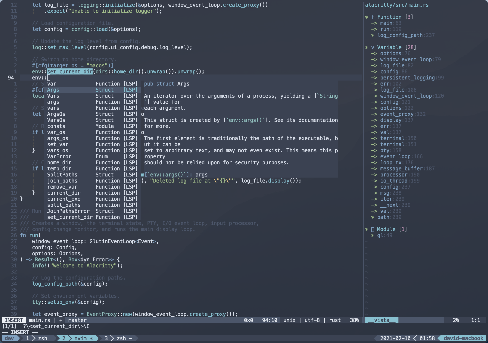
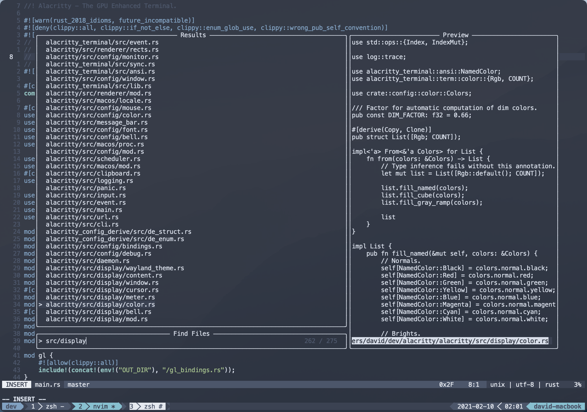

# Neovim Setups

## Install Or Update Plugins

```sh
:Lazy sync
:TSUpdate
```

首次 bootstrap 安装插件时，`app/nvim/init.fish` 也会执行同一套流程。

## IME Auto Switch

`nvim-auto-ime` 依赖 `macism`。`./bootstrap` 执行的 `brew bundle` 现在会通过 `Brewfile` 自动安装它。

当前配置中的 `ime_default` 固定为英文输入法 `com.apple.keylayout.ABC`。

`ime_source` 的逻辑是：

- 启动 `nvim` 时如果当前输入法不是英文，则自动把当前输入法作为备用输入法
- 如果启动时当前就是英文，则回退到 [pack.lua](../../rc/config/nvim/lua/pack.lua) 里的手动兜底值

如果你想调整兜底值，可先在 macOS 里手动切到你希望作为备用的输入法，再执行：

```sh
macism
```

把输出的输入源 ID 写回 `pack.lua` 里的 `ime_fallback` 即可。

## Screenshots




